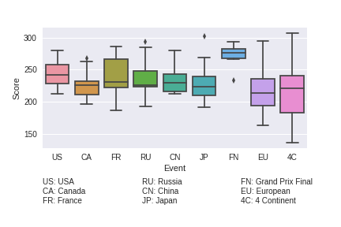
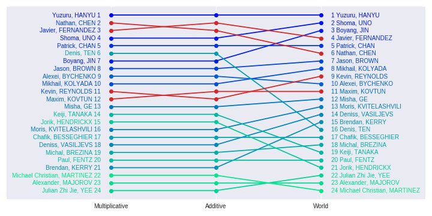
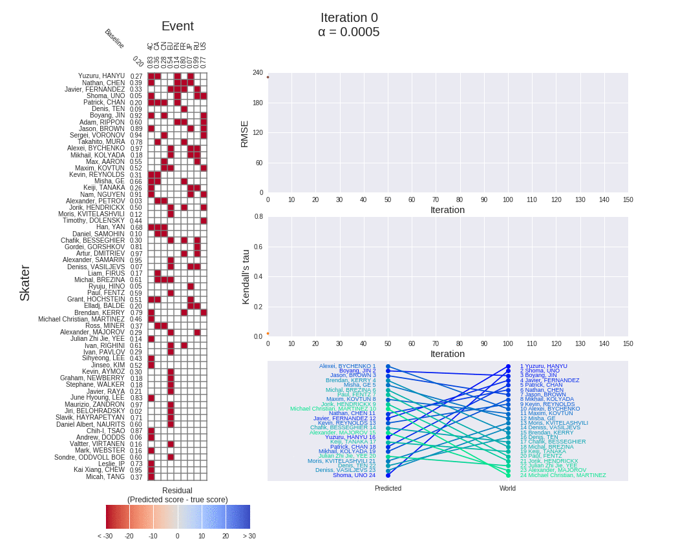
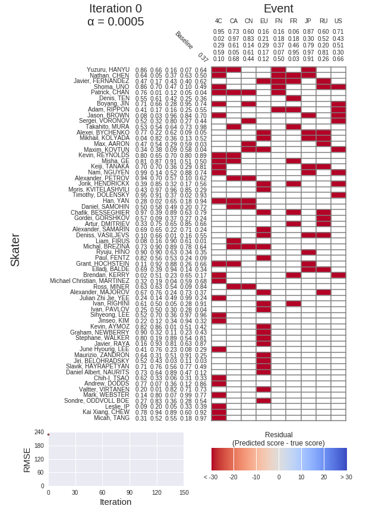

# Predict ranking of figure skating world championship from earlier events in the season

This is my personal project of trying to predict the ranking of skaters in the annual figure skating world championship. 
The obvious way to rank skaters is by taking their average scores of past competition events in the season and rank them
from highest to lowest. However, one potential problem with this approach is that the scores are averaged over different
events, and no two events are the same (think different judges, ice conditions, or even altitudes where the events took place). As seen in the below box plot for the male skaters in the 2017 season, the center and spread of scores for each event can be remarkably different from one another. 

Therefore, I came up with different ranking models that could tease out the skater effect (how good a skater
intrinsically) from the event effect (how does an event affect the score of a skater). All models are coded using numpy
and pandas, along with some built-in Python modules (such as itertools). 

The project consists of multiple parts:

* **Part 1:** simpler linear models with ridge regression ([analysis](analysis_part1.ipynb), [write-up](https://towardsdatascience.com/predicting-figure-skating-championship-ranking-from-season-performances-fc704fa7971a?source=friends_link&sk=7e6b2992c6dd5e6e7e1803c574b4236d))

* **Part 2:** hybrid model (single-factor) learned by gradient descent, with model penalization and early stopping ([analysis](analysis_part2.ipynb), [write-up](https://medium.com/@seismatica/predicting-figure-skating-world-championship-ranking-from-season-performances-part-2-hybrid-7d296747b15))

* **Part 3:** multi-factor model learned by gradient descent ([analysis](analysis_part3.ipynb), [write-up](https://medium.com/@seismatica/predict-figure-skating-world-championship-ranking-from-season-performances-8af099351e9c?source=friends_link&sk=48c2971de1a7aa77352eb96eec77f249))

* **Part 4:** combine multiple latent factors to rank skaters (coming soon)

Data from the project were scraped from the score websites of the International Skating Union (www.isuresults.com).
The code used to scrap and clean the scores is found in the [data_processing](data_processing.ipynb) notebook
The cleaned scores are found in the [scores](scores) subfolder, and output visualizations in the [viz](viz) subfolder.

For any question or feedback, please don't hesitate to contact me here or on Medium!

